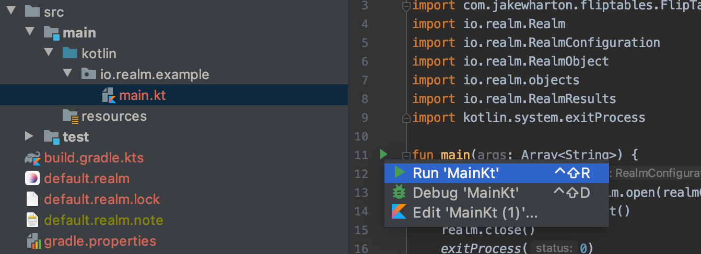

# Ejemplo sencillo de uso de la SDK Kotlin de Realm con Java 8

Ejemplo creado modificando este código de muestra: https://github.com/realm/realm-kotlin-samples/tree/main/JVMConsole


## Run from IntelliJ IDEA

Navigate to `src/main/kotlin/io.realm/example/main.kt`
Click on `Run MainKt` 


## Standalone jar

```Gradle
./gradlew clean jar
java -jar build/libs/JVM_Console-1.0.0.jar
```

